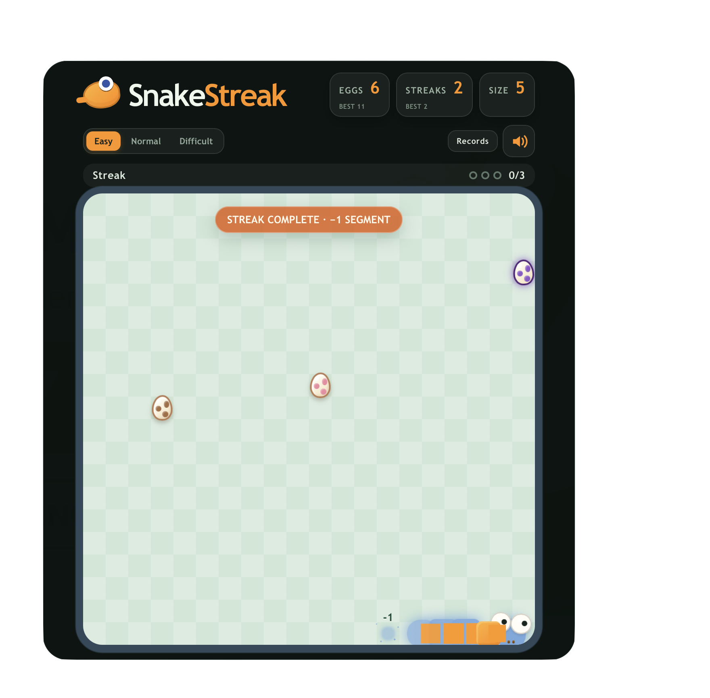
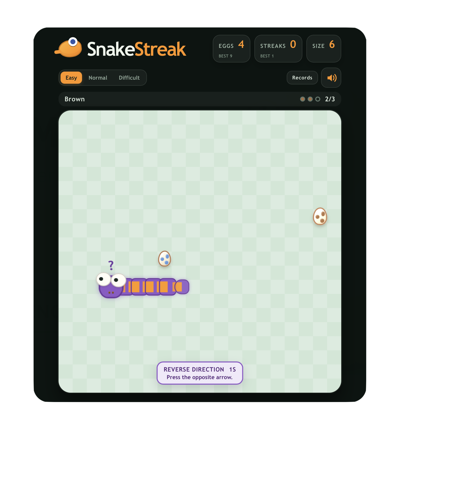
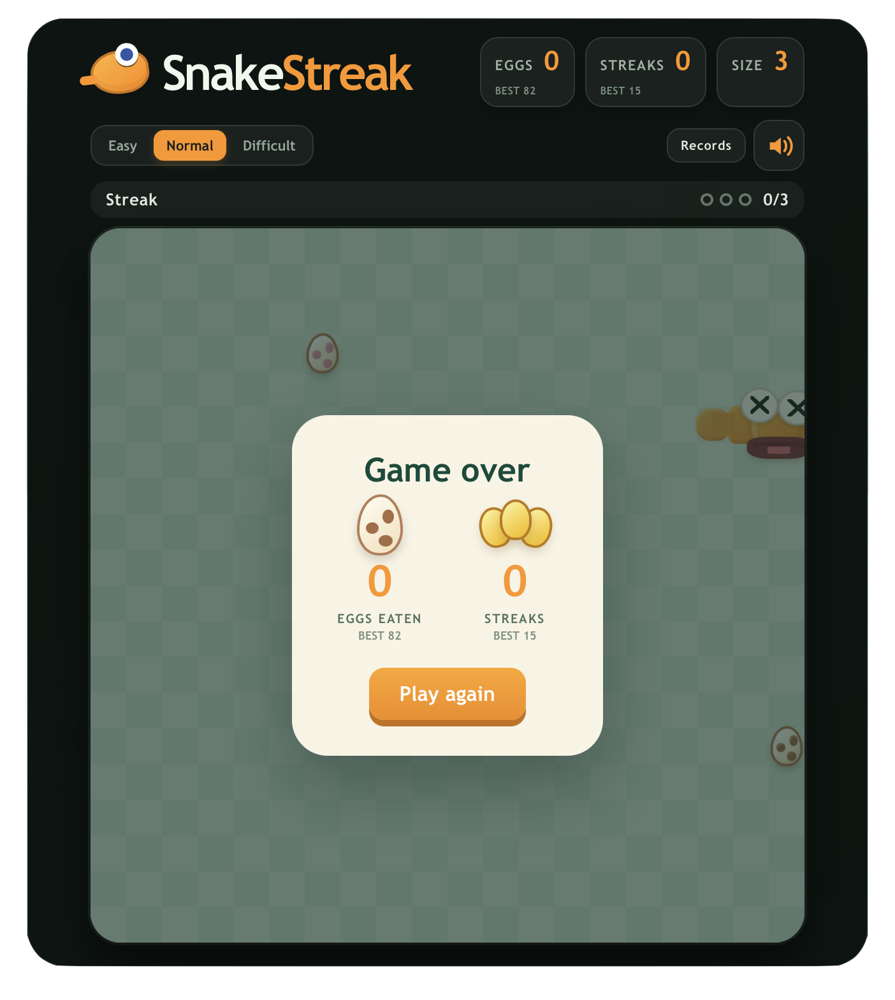

# SnakeStreak

SnakeStreak is a strategic twist on the classic Snake game. Collect eggs, build colour streaks, avoid purple confusion eggs, and survive long enough to master the board.

## Screenshots

<table>
  <tr>
    <td align="center"><strong>Streak reward</strong></td>
    <td align="center"><strong>Purple confusion</strong></td>
    <td align="center"><strong>Game over</strong></td>
  </tr>
  <tr>
    <td align="center"></td>
    <td align="center"></td>
    <td align="center"></td>
  </tr>
</table>

## Features

- Classic grid-based Snake movement with keyboard and touch-swipe controls.
- Three difficulty modes with different movement speeds and confusion durations.
- Two-egg choice system that makes route planning more strategic.
- Colour streaks: collect three matching eggs to trigger a visible reward and shrink the snake by one segment.
- Purple confusion eggs that reverse the controls for a limited time.
- Difficult-mode purple surges with a visible `3, 2, 1` warning countdown.
- Golden eggs that create a temporary wildcard effect.
- Tail dissolve and reward animations for streak completion.
- Wall impact animation, crash feedback, and a dedicated WOW victory scene.
- Score, eggs-eaten, streak, snake-size, and personal-record tracking.
- Responsive layout for desktop, phone, and tablet screens.
- Optional sound effects with mobile-safe audio unlocking.

## How to Play

1. Choose a difficulty mode.
2. Use the arrow keys on desktop or swipe anywhere on the board on mobile and tablet.
3. Collect eggs while avoiding the snake's body and the board boundary.
4. Plan around the active streak colour to collect three matching eggs.
5. Avoid purple eggs unless you are ready for reversed controls.

## Tech Stack

- React
- JavaScript
- Vite
- CSS
- Web Audio API
- Browser `localStorage` for personal records

## Getting Started

```bash
npm install
npm run dev
```

Open the local URL shown by Vite in your browser.

## Available Scripts

```bash
npm run dev      # Start the development server
npm run lint     # Run ESLint
npm run build    # Create a production build
npm run preview  # Preview the production build locally
```

## Project Structure

```text
src/
├── App.jsx                  # Main game state and gameplay rules
├── App.css                  # Layout, responsive styles, and animations
├── audio/                   # Sound effect setup and playback helpers
├── components/              # Board, snake, food, records, and victory UI
├── game/                    # Movement, food placement, and record utilities
└── assets/
    ├── images/              # Project screenshots
    └── sounds/              # Game sound effects
```

## Learning Goals

This project demonstrates React state management, immutable array updates, keyboard and pointer events, timed game loops, collision detection, responsive CSS, animation states, audio handling, and local persistence.

## Future Improvements

- Add more board themes and snake skins.
- Add an accessible high-contrast mode.
- Add replay or challenge mode for portfolio demonstrations.
- Add automated tests for movement, collision, and food-placement rules.

## License

This project is intended as a personal programming portfolio project.
